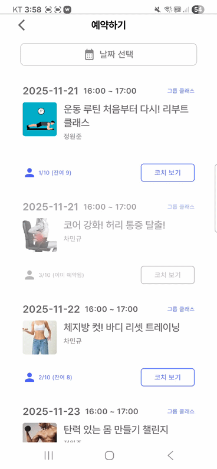
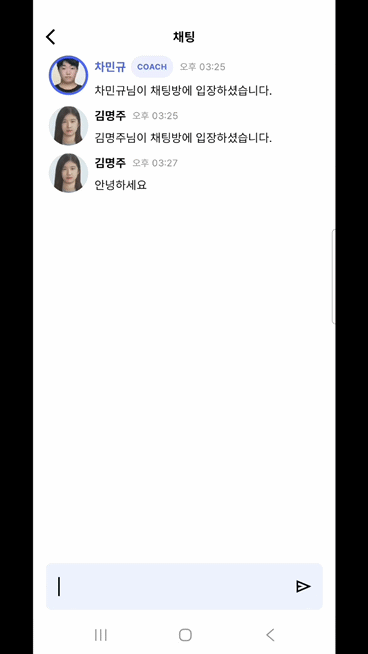
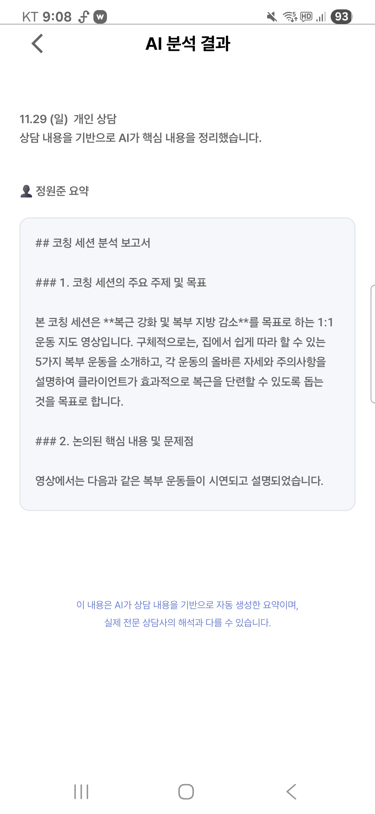
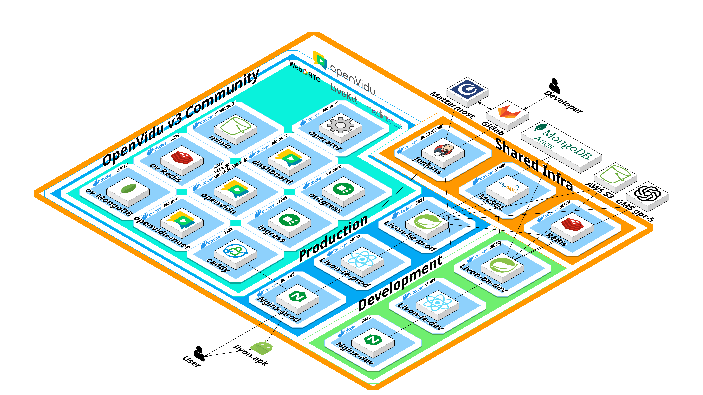

# README.md

# LivOn - AI·휴먼코치 기반 라이브 스트리밍 실시간 상담 및 코칭 서비스

## 📋 프로젝트 개요

LivOn은 AI와 휴먼 코치가 결합된 라이브 스트리밍 기반의 실시간 상담 및 코칭 서비스입니다. 사용자는 웹과 모바일 앱을 통해 1:1 또는 그룹 상담을 예약하고, 실시간 화상 스트리밍으로 코칭을 받을 수 있습니다.

- **개발 기간** : 2025.10.10 ~ 2025.11.28
- **플랫폼** : Web (React + TypeScript), Android Native App (Kotlin · Jetpack Compose)
- **개발 인원** : 6명

---

## 🛠️ 기술 스택

<div align="center"> 
<!-- Backend Core --> 
 
 
 
 
 
 


<br/> 
<!-- Backend Tools --> 
 
 
 


<br/> 
<!-- Web Frontend --> 
 
 
 
 


<br/> 
<!-- Mobile Frontend --> 
 
 
 
 
 


<br/> 
<!-- DevOps / Cloud --> 
 
 
 
 
 


<br/> 
<!-- AI --> 
 


<br/> 
<!-- Video Conference --> 
 

 
<br/> 
</div>

### Backend

- **언어**: Java 17
- **프레임워크**: Spring Boot 3.3.1
- **데이터베이스**: MySQL, MongoDB, Redis
- **보안**: Spring Security, JWT
- **실시간 통신**: WebSocket, STOMP
- **주요 기술**:
  - Spring Data JPA
  - Spring WebFlux
  - Spring Data Redis
  - Redisson (분산 락)
  - Firebase Admin SDK
  - LiveKit Server SDK (화상 회의)

### Frontend - Web

- **언어**: TypeScript
- **프레임워크**: React 19.2.0
- **주요 라이브러리**:
  - React Router DOM 7.9.4
  - Styled Components 6.1.19
  - Axios 1.13.2
  - LiveKit Client 2.15.14
  - STOMP.js 7.2.1

### Frontend - Mobile

- **언어**: Kotlin
- **프레임워크**: Android (Jetpack Compose)
- **최소 SDK**: 23 / 타겟 SDK: 35
- **주요 라이브러리**:
  - Jetpack Compose
  - LiveKit Android SDK
  - Retrofit 2.9.0
  - OkHttp 4.12.0
  - Moshi (JSON 처리)
  - STOMP Protocol Android

### Infrastructure

- **클라우드**: AWS EC2, GCP (Vertex AI, Cloud Storage)
- **CI/CD**: Jenkins, GitLab
- **컨테이너**: Docker, Docker Compose
- **웹서버**: Nginx
- **화상 회의**: OpenVidu V3 (Caddy, LiveKit, Meet, Dashboard)
- **스토리지**: AWS S3, MinIO
- **AI**: Google Vertex AI, OpenAI GPT

---

## 📁 프로젝트 구조

```
S13P31S406/
│
├── LivOnBack/                    # 백엔드 (Spring Boot)
│   ├── src/
│   │   ├── main/
│   │   │   ├── java/com/s406/livon/
│   │   │   │   └── [177개 Java 파일]
│   │   │   └── resources/
│   │   │       ├── application-dev.yml
│   │   │       ├── application-local.yml
│   │   │       ├── application-prod.yml
│   │   │       ├── keys/
│   │   │       └── logback-spring.xml
│   │   └── test/
│   │       └── java/com/s406/livon/
│   ├── build.gradle
│   └── Dockerfile
│
├── LivOnFront/
│   │
│   ├── web/                       # 웹 프론트엔드 (React)
│   │   ├── src/
│   │   │   ├── api/               # API 호출 함수
│   │   │   │   ├── authApi.ts
│   │   │   │   ├── chattingApi.ts
│   │   │   │   ├── classApi.ts
│   │   │   │   ├── reservationApi.ts
│   │   │   │   └── streamingApi.ts
│   │   │   ├── components/        # 재사용 컴포넌트
│   │   │   │   ├── common/        # 공통 컴포넌트
│   │   │   │   ├── layout/        # 레이아웃 컴포넌트
│   │   │   │   └── streaming/     # 스트리밍 관련 컴포넌트
│   │   │   ├── pages/             # 페이지 컴포넌트
│   │   │   │   ├── auth/          # 인증 페이지
│   │   │   │   ├── coach/         # 코치 페이지
│   │   │   │   ├── main/          # 메인 페이지
│   │   │   │   └── support/       # 고객지원 페이지
│   │   │   ├── hooks/             # 커스텀 React Hooks
│   │   │   ├── routes/            # 라우팅 설정
│   │   │   ├── types/             # TypeScript 타입 정의
│   │   │   ├── utils/             # 유틸리티 함수
│   │   │   └── styles/            # 스타일 파일
│   │   ├── public/
│   │   ├── package.json
│   │   ├── tsconfig.json
│   │   └── Dockerfile
│   │
│   └── mobile/                    # 모바일 앱 (Android/Kotlin)
│       ├── app/
│       │   ├── src/
│       │   │   ├── main/
│       │   │   │   ├── java/      # [167개 Kotlin 파일]
│       │   │   │   ├── res/       # 리소스 (UI, 이미지 등)
│       │   │   │   └── AndroidManifest.xml
│       │   │   ├── test/
│       │   │   └── androidTest/
│       │   ├── build.gradle.kts
│       │   └── release/
│       │       └── app-release.apk
│       ├── build.gradle.kts
│       ├── settings.gradle.kts
│       ├── local.properties
│       └── Dockerfile
│
├── LivOnInfra/                    # 인프라 설정
│   ├── docker-compose.dev.yml
│   ├── docker-compose.prod.yml
│   └── nginx/
│       ├── Dockerfile.dev
│       ├── Dockerfile.prod
│       ├── nginx.dev.conf
│       └── nginx.prod.conf
│
├── exec/                          # 실행 관련 문서
│   ├── Dump20251120.sql           # 데이터베이스 덤프
│   ├── PORTING_MANUAL.pdf         # 포팅 매뉴얼
│   └── 외부 서비스 정보 및 시연시나리오.md
│
├── Jenkinsfile                    # CI/CD 파이프라인 설정
└── README.md
```

---

## 🎯 주요 기능

### 1. 클래스 및 예약 시스템

- 1:1 개인 상담 및 그룹 상담 클래스 조회
- 실시간 예약 시스템
- 날짜/시간 기반 예약 관리

_1_1_상담_png.png>)

_예약확인.gif>)



### 2. 실시간 스트리밍 및 화상 회의

- OpenVidu V3/LiveKit 기반 화상 회의
- 실시간 화면 공유
- 다중 참여자 지원
- 비디오/오디오 제어

_1_1_상담_png.png>)

### 3. 실시간 채팅

- WebSocket 기반 실시간 채팅
- STOMP 프로토콜 사용
- 그룹 채팅 지원
  

### 4. AI 기반 상담 분석

- Google Vertex AI를 통한 상담 영상 분석 및 요약
- OpenAI GPT를 활용한 생체 정보 AI 요약
  

### 5. 영상 저장 및 관리

- MinIO를 활용한 상담 영상 저장
- 영상 재생 및 다운로드

---

## 🏗 시스템 아키텍처

- **CI/CD**: Jenkins를 활용해 자동화된 빌드 및 배포 파이프라인 구축
- **협업 알림**: Merge Request 생성 및 배포 빌드 시 Mattermost로 실시간 알림 전송
- **배포 환경 분리**: 테스트 서버(Dev)와 운영 서버(Prod)를 분리하여 안정적인 배포 및 운영 환경 보장
- **보안 및 가용성 강화**:
  - Nginx Reverse Proxy + SSL 인증서 적용
  - Docker 기반 컨테이너화로 일관된 실행 환경 확보
  - Redis 세션 캐싱을 통해 인증 및 챌린지 처리 성능 최적화



---

## 🌐 외부 서비스

| 서비스명        | 제공사         | 주요 역할                                | 통신 방식                                  |
| --------------- | -------------- | ---------------------------------------- | ------------------------------------------ |
| **OpenVidu V3** | OpenVidu       | 화상 회의, 화면 공유, 스트리밍           | WebSocket (시그널링), WebRTC (미디어 전송) |
| **Vertex AI**   | Google Cloud   | 1:1 상담 영상 기반 요약 정보 제공        | REST API / gRPC                            |
| **GPT**         | OpenAI         | 사용자의 생체 정보 AI 요약 정보 제공     | REST API (HTTPS)                           |
| **MongoDB**     | MongoDB Inc.   | 비정형 데이터 저장                       | MongoDB Wire Protocol (TLS)                |
| **S3**          | Amazon         | 사용자 프로필 사진 저장                  | REST API (HTTPS), SDK 호출                 |
| **MinIO**       | MinIO, Inc.    | 상담 영상 저장                           | S3 API(HTTPS), MinIO SDK                   |
| **SMTP**        | Email Provider | 인증 메일 발송                           | SMTP / SMTPS (TLS)                         |
| **Redis**       | Redis Inc.     | 토큰 저장, 세션 캐싱, 일시적 데이터 관리 | RESP 프로토콜 (TCP)                        |

---

## 🚀 설치 및 실행 방법

---

### 사전 요구사항

- Java 17
- Node.js 18+
- Docker & Docker Compose
- Android Studio (모바일 앱 개발 시)
- MySQL 8.0+
- MongoDB
- Redis

### Backend 실행

```bash
cd LivOnBack

# Gradle 빌드
./gradlew build

# 로컬 환경 실행
./gradlew bootRun --args='--spring.profiles.active=local'

# 또는 JAR 파일 실행
java -jar build/libs/LivOn-0.0.1-SNAPSHOT.jar --spring.profiles.active=local

```

### Web Frontend 실행

```bash
cd LivOnFront/web

# 의존성 설치
npm install

# 개발 서버 실행
npm start

# 프로덕션 빌드
npm run build

```

### Mobile App 실행

```bash
cd LivOnFront/mobile

# Android Studio에서 프로젝트 열기
# 또는 명령줄에서 빌드

./gradlew assembleRelease
```

### Docker Compose로 전체 시스템 실행

```bash
cd LivOnInfra

# 개발 환경
docker-compose -f docker-compose.dev.yml up -d

# 프로덕션 환경
docker-compose -f docker-compose.prod.yml up -d

```

---

## ⚙️ 환경 설정

---

### Backend 환경변수

`LivOnBack/src/main/resources/application-{profile}.yml` 파일에서 설정:

- 데이터베이스 연결 정보 (MySQL, MongoDB, Redis)
- JWT 시크릿 키
- AWS S3 자격 증명
- MinIO 접속 정보
- Firebase 설정
- SMTP 설정
- LiveKit/OpenVidu 서버 정보
- Google Cloud Vertex AI 자격 증명

### Web Frontend 환경변수

`LivOnFront/web/src/constants/config.ts`에서 설정:

- API 서버 URL
- WebSocket 서버 URL
- LiveKit 서버 URL

### Mobile App 환경변수

`LivOnFront/mobile/local.properties`에서 설정:

```
openvidu.livekit.url=your_livekit_url
application.server.url=your_api_server_url
cleartext.ip=your_server_ip
websocket.token=your_websocket_token
websocket.url=your_websocket_url
```

---

## 📝 API 문서

Backend 서버 실행 후 Swagger UI를 통해 API 문서 확인:

```
<http://localhost:8080/swagger-ui/index.html>
```

---

## 🧪 테스트

---

### Backend 테스트

```bash
cd LivOnBack
./gradlew test
```

### Web Frontend 테스트

```bash
cd LivOnFront/web
npm test
```

## 👥 팀 소개

삼성 청년 SW 아카데미(SSAFY) 13기 기업 연계 프로젝트 S406팀

팀명: 근육유지보수

## 👥 팀원

| 이름          | 포지션        | 주요 역할                                                                                                                                                    |
| ------------- | ------------- | ------------------------------------------------------------------------------------------------------------------------------------------------------------ |
| 정원준 (팀장) | 백엔드        | 백엔드 주요 비즈니스 로직 구현                                                                                                                               |
| 김명주        | 앱 프론트엔드 | 앱 스트리밍 화면 구현, OpenVidu 3, 웹소켓                                                                                                                    |
| 박민수        | 인프라/DevOps | Docker·Jenkins 파이프라인 구축, 시크릿/환경변수 관리, Nginx 리버스 프록시 및 SSL, 보안 설정(헤더, 레이트 리밋, 헬스체크), GCP AI 파이프라인 구축, OpenVidu 3 |
| 전재욱        | 백엔드        | 백엔드 개발 세팅, 웹소켓 채팅 구현, Aop 로깅 구현                                                                                                            |
| 제효정        | 앱 프론트엔드 | 앱 회원 화면 구현, 앱 API 연동                                                                                                                               |
| 차민규        | 웹 프론트엔드 | 웹 화면 구현, OpenVidu 3, 웹 API 연동, 영상 포트폴리오 제작                                                                                                  |
|               |               |                                                                                                                                                              |

## 📄 라이선스

이 프로젝트는 교육 목적으로 개발되었습니다.

---

**Version**: 0.0.1-SNAPSHOT

**Last Updated**: 2025.11.21
